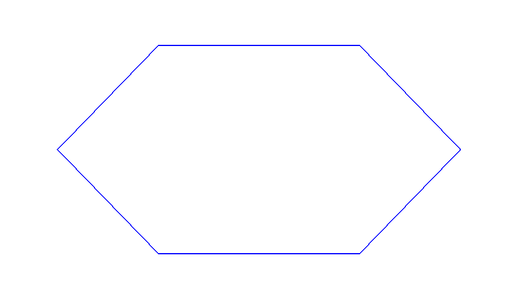
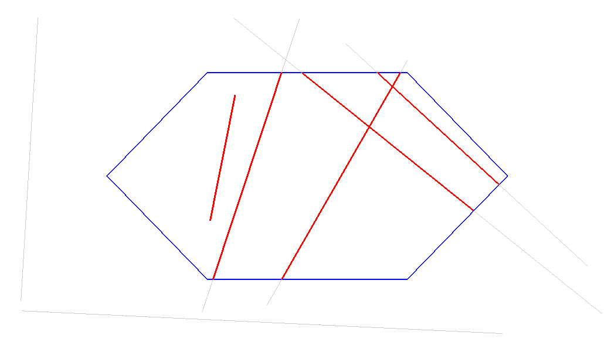

# Atividade Cyrus-Beck (OpenGL)

Implementação do algoritmo de recorte Cyrus-Beck em C++ para a disciplina de Computação Gráfica.

## 🚀 Compilação e Execução

Abra o terminal na pasta do projeto e use os comandos:

1. **Compilar:**

     make

2.**Executar:**

    make run

