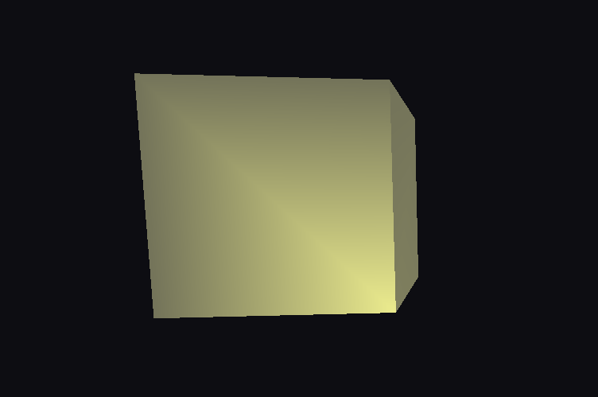
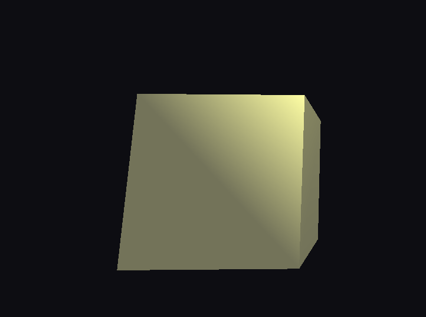
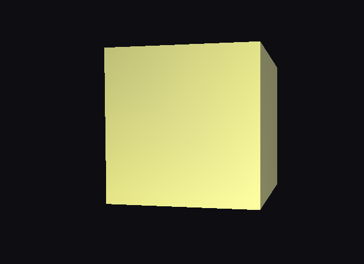
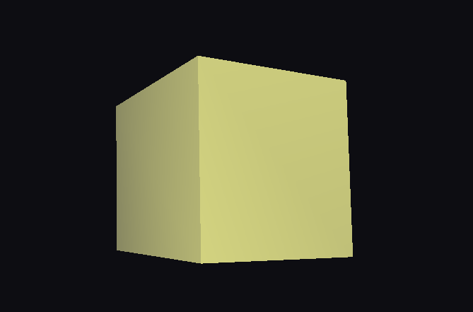

# Ex 10 - Fontes de Luz

Este projeto implementa uma lanterna (spotlight) que segue o observador no espaço da câmera.

## Compilação
Use o VSCode:

g++ src/main.cpp -o build/lanterna.exe -lfreeglut -lopengl32 -lglu32

## Execução

build/lanterna.exe

## Controles

W / S : andar para frente / trás
A / D : strafing esquerda / direita
Q / E : subir / descer
Setas: virar / inclinar a câmera (yaw / pitch)
ESC : sair

